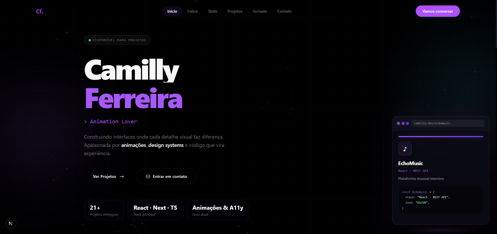

<div align="center">

# ✦ Camylly Ferreira — Portfolio

Experiências digitais modernas com foco em animações, performance e interfaces premium.

<br/>



<br/>

[]()
[]()
[]()
[]()
[]()

</div>

---

## ✦ Sobre o projeto

Este projeto é meu portfólio pessoal desenvolvido para transmitir uma experiência visual moderna e imersiva.

O foco principal foi criar uma interface:
- elegante
- altamente animada
- responsiva
- cinematográfica
- com forte atenção aos detalhes visuais

Inspirado em websites premium e experiências interativas modernas.

---

# ✦ Tecnologias

```bash
Next.js
React
TypeScript
Tailwind CSS
Framer Motion
GSAP